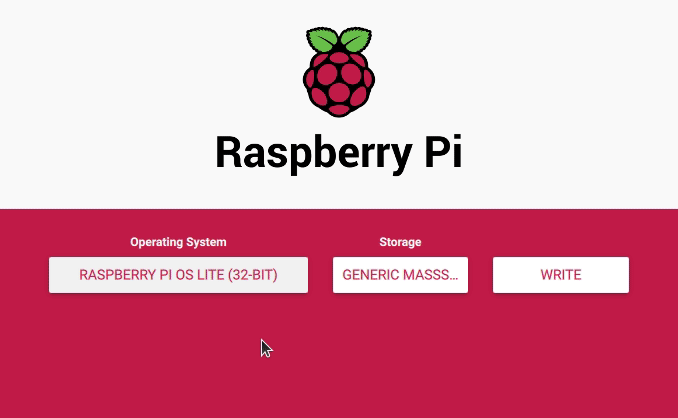

# Preparación de la SD

La siguientes instrucciones son para instalar la Raspberry en modo "headless" (sin teclado, mouse o monitor).

## Instalar sistema operativo

Descargar software Pi Imager: https://www.raspberrypi.org/software/

Se puede instalar cualquier OS, estas instrucciones van a usar el más ligero **"Raspberry PI OS Lite (32 bit)"**



## Activar SSH

Se puede hacer desde el terminal o crear un archivo vacio y sin extensión llamado `ssh` dentro de la carpeta principal. Esto lo vamos a usar para controlar la Raspberry desde un computador aparte.


## Configurar WIFI

Crear archivo `wpa_supplicant.conf` en la carpeta principal, dentro de este archivo pegar lo siguiente:

```bash
country=CO
ctrl_interface=DIR=/var/run/wpa_supplicant GROUP=netdev
update_config=1

network={
  scan_ssid=1
  ssid=""
  psk=""
}
```

Cambiar el [código de país](https://en.wikipedia.org/wiki/ISO_3166-1_alpha-2#Officially_assigned_code_elements)

Agregar el nombre de la red en `ssid=""` y la clave del wifi en `psk=""`


Ya se puede sacar la SD del computador. Conectarla a la Raspberry y conectarla a corriente para que inicie. Se debería conectar automaticamente al WIFI que configuramos antes.

